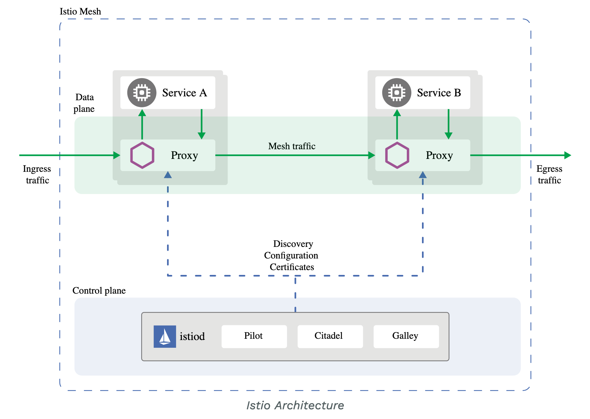

# Cloud Native Applications

Cloud native is a term used to describe container-based environments. Cloud-native technologies are used to develop applications built with services packaged in containers, deployed as microservices and managed on elastic infrastructure through agile DevOps processes and continuous delivery workflows.

[Cloud Native Computing Foundation (CNCF)](https://www.cncf.io/), [launched](https://www.cncf.io/announcements/2015/06/21/new-cloud-native-computing-foundation-to-drive-alignment-among-container-technologies/) in 2015 by the Linux Foundation.

## Attributes of Cloud native applications

**Key attributes:**
1. Containerized
2. Dynamically orchestrated
3. Microservices oriented

**Other attributes**

4. Developed with best-of-breed languages and frameworks
5. Centered around APIs for interaction and collaboration
6. Architected with a clean separation of stateless and stateful services
7. Isolated from server and operating system dependencies
8. Deployed on self-service, elastic, cloud infrastructure
9. Managed through agile DevOps processes
10. Automated capabilities
11. Defined, policy-driven resource allocation

Reference - https://thenewstack.io/10-key-attributes-of-cloud-native-applications/

## Monolithic vs Microservices architecture

**Microservices** - a style that structures an application as a collection of services that are:

- Highly maintainable and testable
- Loosely coupled
- Independently deployable
- Organized around business capabilities
- Owned by a small team

**Monolithic** - a style where single-tiered software application in which different components combined into a single program from a single platform.

## Service mesh

**Service mesh** - an infrastructure layer for facilitating service-to-service communications between microservices, often using a **sidecar proxy**.

**Provides:**

  - Connection between microservices
  - Monitoring, observability into communications
  - Securing
  - Control

## Platforms implementing a service mesh:

  - **Istio**
  - Consul
  - Linkerd
  - ...

# Istio

**Istio** - a platform that does a service mesh (provides a uniform way to secure, connect, and monitor microservices).

## What you can do with Istio?

Istio provides operational requirements:

- canary rollout (deployment)
- A/B testing
- rate limiting
- access control
- end-to-end authentication