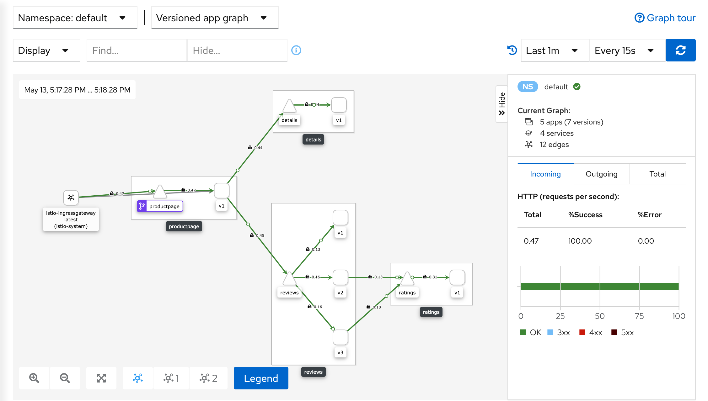

# Labs

## Objectives

1. Quick start with Istio
2. Route requests
3. Traffic shifting (canary rollout)

## Before starting

1. Install Minikube and start a Kubernetes cluster

After Minikube installation run:

- `minikube config set vm-driver virtualbox` (or `vmware`, or `kvm2`)
- `minikube start --memory=16384 --cpus=4 --kubernetes-version=v1.18.0`

**Note!** If you don’t have enough RAM to allocate to the minikube virtual machine then try to put the maximum you have on your laptop.

Reference - https://istio.io/docs/setup/platform-setup/minikube/

## 1. Quick start with Istio

This task lets you quickly evaluate Istio.

Instructions - https://istio.io/docs/setup/getting-started/

Do everything until [Next steps](https://istio.io/docs/setup/getting-started/#next-steps) section.

**Results:**

- running [Bookinfo example application](https://istio.io/docs/examples/bookinfo/) and available at `http://$GATEWAY_URL/productpage` (where $GATEWAY_URL - is specific IP and PORT for every deployment)
- running [Kiali dashboard](https://kiali.io/) with an overview of your mesh with the relationships between the services

## 2. Request Routing

This task shows you how to route requests dynamically to multiple versions of a microservice.

Instructions - https://istio.io/docs/tasks/traffic-management/request-routing/

**Results:**

- sending 100% of the traffic to the `v1` version of each of the Bookinfo services
- setting a rule to selectively send traffic to version `v2` of the reviews service based on a custom `end-user` header

## 3. Traffic Shifting (canary rollout)

This task shows you how to gradually migrate traffic from an older version to a new version.

Instructions - https://istio.io/docs/tasks/traffic-management/traffic-shifting/

**Results:**

- migrating traffic from an old to new version of the `reviews` service using Istio’s weighted routing feature